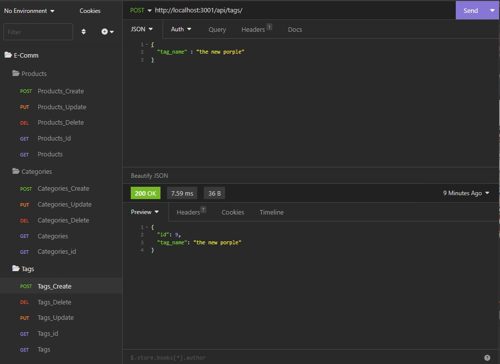

# E-Commerce-Back_End
Back-End to controll a database of products.


## Usage
To track/Update/add products to your database.

## How To Use
Download the Repo to your local machine or fork it whichever you prefer. 
When you have it open in your editor, install all modules with ```npm install```. 
Get into MySQL with ```mysql -u root -p``` then type ```source db/schema.sql``` next in a bash terminal run ```node seeds```. 
Start the server by typing ```node server.js``` then go use a tool like Insomnia to view/edit data.

## Youtube Video
https://www.youtube.com/watch?v=5AfeK_DExB4
